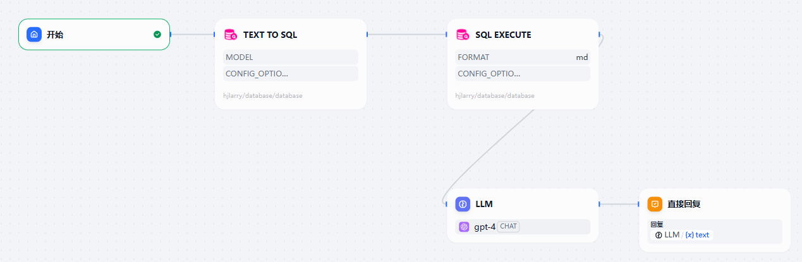
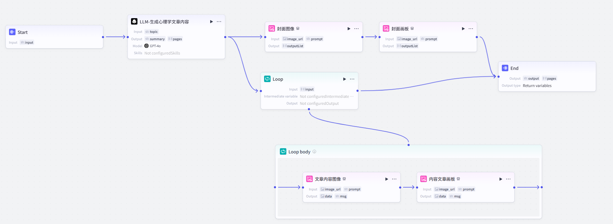

# Project Showcase

本仓库用于展示本人使用 AI 工具、开发网站与工作流的能力，相关项目均为面向面试官演示而开发，体现了对 AI 环境和工具的实际应用和尝试。

---

## 目录结构说明

### 1. 网站项目（使用 Cursor 编写）
- **chick**  
  简单产品推广网站。  
  [在线访问 chick](https://rococo-strudel-710350.netlify.app/)

- **jellycat**  
  简单产品推广网站。  
  [在线访问 jellycat](https://qiezongbonk.xyz/)

- **music**  
  简单产品推广网站。  
  [在线访问 music](https://visionary-piroshki-ce7f1d.netlify.app/)

> 以上三个网站均为帮助朋友推销相关产品而制作，前端代码均使用 [Cursor](https://www.cursor.so/) 编辑器编写

---

### 2. AI 工作流与自动化项目

- **Dify-NL--_SQL.yml**  
  采用 Dify 平台开发的工作流，实现将自然语言自动转换为 SQL 语句，并输出相应的数据库查询结果和文本解释，适用于数据查询自动化、低代码数据分析场景。

- **coze-心理学图文普及.txt**  
  使用 Coze 平台开发的心理学主题讲解和图文生成工作流，输入心理学相关主题后，可自动输出结构化科普内容和配图，适用于心理学科普、内容创作等需求。

---

## 备注

> 本仓库所有项目仅用于个人展示，帮助面试官快速了解本人在 AI 应用、No-Code/Low-Code 工作流搭建、Web 前端开发等方面的动手能力与探索精神.

## 参考资料

- 抖音博主. “coze教程”. 抖音账号: @卢哥-AI
- 抖音博主. “comfyui教程”. 抖音账号: @极简AI.
-  **Skormino**. *Pixel Art Style "Illustrious"*. Civitai 模型，发布于 Civitai。链接：[https://civitai.com/models/1631459/pixel-art-style-illustrious-by-skormino](https://civitai.com/models/1631459/pixel-art-style-illustrious-by-skormino)。访问日期：2025‑07‑22。
- **啦啦啦的小黄瓜**，《ComfyUI教程：大模型的下载、分类、架构讲解》，Bilibili 视频，2024‑07‑02，链接：https://www.bilibili.com/video/BV1e1421k7Gy/（访问日期：2025‑07‑22）。

